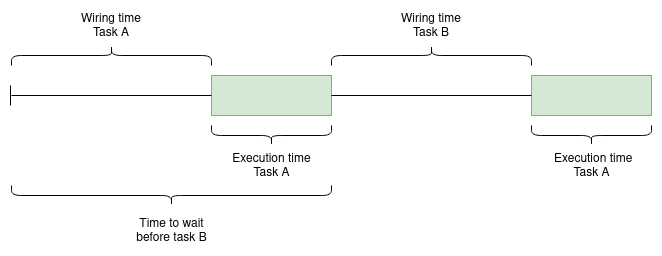

    >> DOCUMENT IN PROGRESS...
    >> DOKUMENTO EN PROGRESO...
    >> DOCUMENTO EN PROGRESO...

## Concurrency - Una Vision general
 
Concurrency es quizás uno de los tópicos más fascinante en Computer Science. La implementación de algoritmos concurrentes, además de su importancia práctica, representa un reto al ingenio y creatividad de cada Software Engineer.

El término Concurrency puede significar algo un tanto diferente en la mente de cada persona involucrada en tecnología. En una definición rapida y acotada:

**Concurrency es la capacidad de un algoritmo de lidiar con múltiples tareas, en un orden no determinístico, para completar su fin.**

Intentar explicar el concepto de concurrency en pocas palabras es todo un desafío. Como es posible explicar el concepto de concurrency sin hablar de *paralelismo*, *time sharing*, *Context Switching*, *thread*, *Multithreading*, *Hyperthreading*, *Multitasking*, *Multiuser*, etc.

## Concurrency - Historia y Contexto

En 1943, la computadora Eniac requería ser configurada y recableada antes de ejecutar una nueva tarea. El procedimiento necesario para ejecutar dos tareas A y B podría representarse:

En este escenario, además del tiempo y esfuerzo necesario durante el proceso manual de recableado, es importante notar que: `MÚLTIPLES tareas esperan su turno para ser ejecutadas en UN computador`. 

En 1949, la computadora EDVAC reemplaza el proceso de cableado de Eniac por la incorporación de **Stored Program Computer**. Esto gracias a la introducción de la arquitectura de computadores **John Von Neumann Architecture**:

De forma general, cada componente:

* **Central Process Unit**: La cual incorpora una *Arithmetic Logic Unit* y *Processor registers* (memoria de acceso rapido)
* **Control unit**: Para el registro de instrucciones y contador de programa
* **Memory** : Para almacenar datos e instrucciones.
* Mecanismos para **Inputs** y **Output**.

Gracias a *John Von Neumann Architecture* el tiempo de configuración requerido es reduce casi por completo al tiempo necesario para cargar/configurar inputs para los *Stored Program Computer* (desde ahora en adelante *programs*) y su ejecución. 
